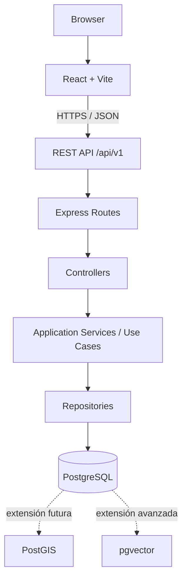
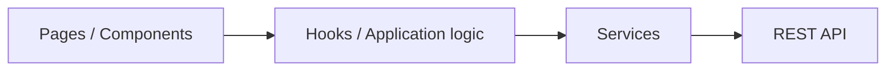
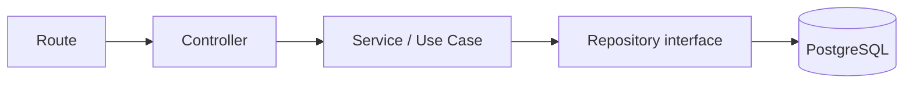
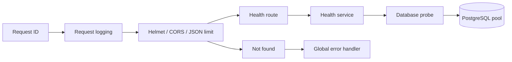
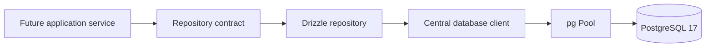
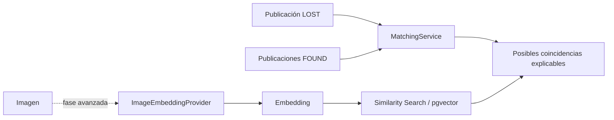

# Arquitectura

## Estado y objetivos

**Estado: arquitectura aceptada; persistencia inicial del Milestone 3 implementada.**

La arquitectura prioriza separación de responsabilidades, cambios incrementales y testabilidad. Se mantendrá un monorepo porque frontend, API, contratos y documentación evolucionarán juntos. No se incorporarán servicios distribuidos sin una necesidad demostrada.

## Vista general



React/Vite y la base Express están inicializados. La API expone únicamente health. PostgreSQL/Drizzle implementa el modelo inicial, migration, seed y repositories, mientras los endpoints de dominio y extensiones siguen pendientes.

## Estructura definitiva propuesta

```text
red-huella/
├── apps/
│   ├── web/src/
│   │   ├── app/ components/ features/ hooks/ layouts/
│   │   ├── pages/ routes/ services/ schemas/ types/
│   │   └── utils/ config/ assets/
│   └── api/src/
│       ├── config/ middleware/ modules/ shared/
│       └── server.ts
├── packages/
│   └── shared/           # Contratos puros compartidos cuando sean necesarios
├── database/
│   ├── migrations/
│   └── seeds/
├── docs/ scripts/ .github/workflows/
└── archivos de gobierno del repositorio
```

Las carpetas se crearán de forma incremental, cuando contengan código real. Dentro de cada módulo backend podrán coexistir `routes`, `controller`, `service`, `repository`, `schemas` y `types`, evitando una jerarquía global difícil de navegar.

## Frontend



- Organización principal por feature (`auth`, `publications`, `animals`, `map`, `favorites`, `matching`, `shelters`, `admin`) conforme se implementen.
- Componentes comunes solo para UI verdaderamente reutilizable.
- Schemas validan datos externos; los services encapsulan HTTP; los hooks coordinan estado y casos de uso de interfaz.
- Estado local por defecto. Una librería global se evaluará únicamente cuando existan requisitos que la justifiquen.
- Rutas, accesibilidad, estados de carga, vacío y error formarán parte de cada feature.

## Backend



- Route: endpoint, middleware y controller.
- Controller: traduce HTTP, obtiene datos ya validados, invoca un caso de uso y construye la respuesta.
- Service/Use Case: reglas, coordinación, autorización contextual y transacciones.
- Repository: persistencia y queries parametrizadas; no expone detalles de BD a controllers.
- Middleware transversal: autenticación futura, límites, correlación y errores; no esconderá reglas de negocio.

La implementación actual separa `routes/health.routes.ts`, `services/health.service.ts` y `database/client.ts`. El health no tiene controller porque añadiría una delegación sin lógica. Las dependencias se inyectan en `createApp` para probar la API sin abrir puertos ni exigir PostgreSQL.



## Comunicación y contratos

La API futura será REST/JSON bajo `/api/v1`. Se definirán respuestas y errores consistentes, paginación y compatibilidad. `packages/shared` alojará únicamente contratos que deban compilarse en ambos lados; no contendrá acceso a Express, React o base de datos.

## Persistencia



`UserRepository`, `AnimalRepository` y `PublicationRepository` exponen únicamente `create` y `findById`. Las implementaciones Drizzle traducen fallos técnicos a `DatabaseError`. No se crean services de negocio ni endpoints temporales para probar repositories.

La suite normal inyecta dependencias sin PostgreSQL. Una suite separada aplica migrations y prueba repositories/constraints contra PostgreSQL real, protegida por una URL exclusiva terminada en `_test`. CI ejecuta esa suite en un job con PostgreSQL 17.

## Tooling del monorepo

La raíz coordina `apps/*` y futuros `packages/*` mediante npm workspaces. Existe un único lockfile y un toolchain compartido para TypeScript, ESLint y Prettier. Cada aplicación conserva scripts de typecheck, test y build. `concurrently` es la única dependencia de orquestación y permite iniciar y detener web/API de forma fiable en Windows, Linux y macOS. Node 24 y npm 11 son las versiones soportadas en esta fase. La CI ejecuta instalación reproducible y todas las comprobaciones raíz.

## Datos y geolocalización

PostgreSQL será la fuente de verdad futura. PostGIS se incorporará cuando se implemente búsqueda geoespacial. El punto exacto privado y la ubicación pública aproximada serán campos/conceptos separados, con permisos distintos. Véanse `DATABASE.md` y `PRIVACY.md`.

## Autenticación

Pendiente de diseño detallado y ADR. Independientemente del mecanismo elegido, autenticación y autorización se impondrán en backend; el frontend no será una frontera de seguridad.

## Matching futuro



El matching tradicional comparará especie, raza, color, tamaño, sexo, distancia y fecha mediante un servicio independiente y testeable. El proveedor de embeddings será intercambiable. La similitud visual complementará otros indicios y se mostrará como “Posible coincidencia”, nunca como identidad confirmada.

## Decisiones y evolución

Las decisiones aceptadas están en `DECISIONS.md`. El modelo persiste solo las cuatro entidades aprobadas; autenticación, APIs de dominio, PostGIS y deployment no se adelantan.
