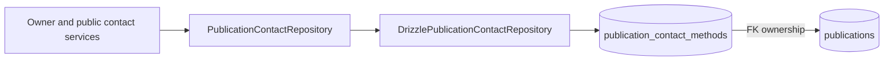
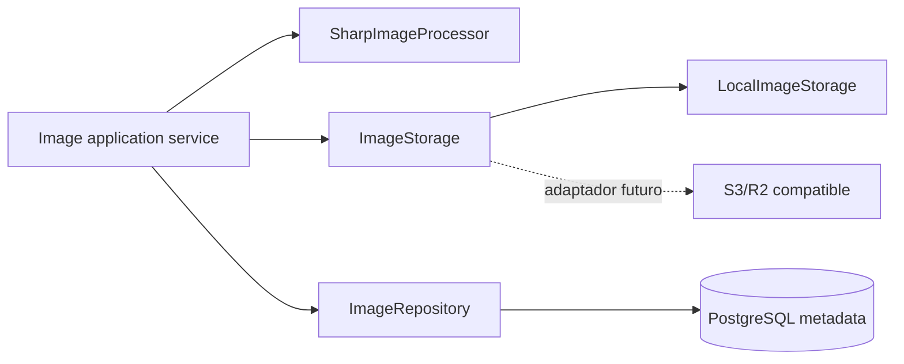
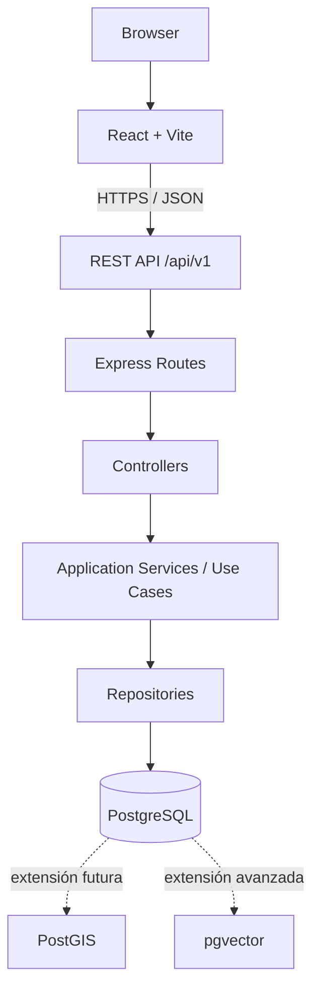
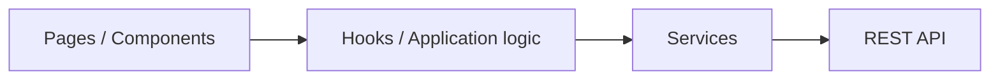
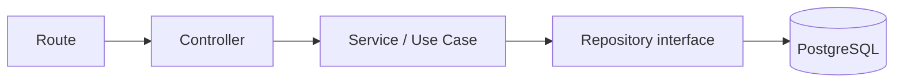
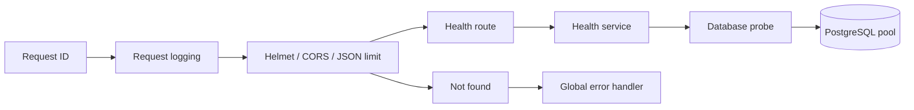
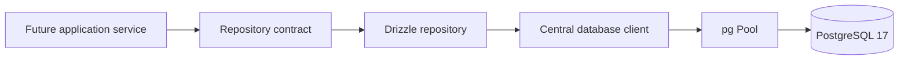
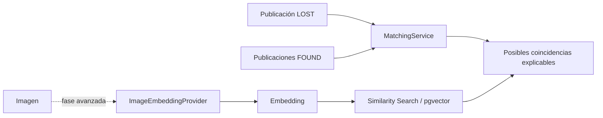

# Arquitectura

## Contacto — Milestone 9, Bloques 1 a 5

ADR-023 introduce un módulo separado del aggregate público. `PublicationContactRepository` encapsula la tabla de PII por publicación y `DrizzlePublicationContactRepository` aplica reemplazo completo transaccional. La validación pura acepta E.164 canónico y normaliza emails antes de persistir.



Los aggregates y repositories públicos no dependen de esta tabla. El Bloque 2 añade controller y casos de uso separados para configuración owner. El Bloque 3 incorpora una revelación autenticada independiente y bajo demanda.

`GET /contact-settings` resuelve publicación y ownership antes de leer PII. `PUT /contact-settings` delega en una operación repository que bloquea `publications` con `SELECT ... FOR UPDATE`, lee la colección, aplica la política recibida y reemplaza dentro de la misma transacción. Así el estado que autoriza la escritura no puede cambiar a mitad de la operación. En estados finales solo acepta un subconjunto de pares tipo/valor idénticos.

`GET /contact` usa una query mínima con joins de publicación, autor y contacto. Solo selecciona estados y pares tipo/valor; no lee aggregates, email de login, ubicación, descripción o imágenes. El service convierte inexistencia, estado final, autor bloqueado y colección vacía en un único error. Dos limiters en memoria se ejecutan tras autenticación: bucket por usuario y bucket adicional por IP.

El frontend owner encapsula WhatsApp, teléfono y email en `ContactSettingsFields`, con React Hook Form/Zod y normalización previa al transporte. En alta conserva el orden `create JSON → ID → contacto/imágenes`; los dos pasos secundarios mantienen errores y reintentos independientes, por lo que nunca recrean la publicación ni repiten un upload correcto. En edición carga `manage` y `contact-settings` en paralelo con una query privada de `staleTime: 0`, eliminada al abandonar la pantalla y en logout. Los estados finales presentan valores de solo lectura y permiten únicamente retirar pares originales.

`PublicationContactPanel` consume `/contact` exclusivamente tras click. Su query nace deshabilitada, usa `staleTime: 0`, `gcTime: 0` y una key formada solo por recurso e ID. Ocultar, cambiar de publicación, desmontar o cerrar sesión elimina la PII de TanStack Query. Los helpers puros construyen exclusivamente `https://wa.me`, `tel:` y `mailto:` después de validación defensiva; los parámetros con texto se codifican mediante `URLSearchParams`.

## Flujo frontend

La búsqueda visual usa una ruta dedicada `/search-by-image`, enlazada desde Explorar para no sobrecargar el mapa. `VisualSearchPage` presenta la interacción; `useVisualSearch` mantiene `File`, object URL, estados y cancelación; el service construye `FormData` y conserva cookies. Cambiar foto, repetir, resetear o desmontar aborta la solicitud anterior, y un identificador monotónico impide que una respuesta obsoleta sustituya resultados recientes.

El flujo es `Browser File → multipart temporal → embedding API → pgvector → candidatos → descarte de la imagen query`. El navegador no persiste el archivo ni lo codifica como base64. El bundle web no contiene Sharp, ONNX ni el modelo CLIP.

El smoke real de cierre confirmó sesión HTTP, multipart, preprocessing, ONNX y ranking pgvector. El proceso carga una única sesión lazy compartida: RSS pasó aproximadamente de 87 MiB a 295 MiB y quedó en 301 MiB tras un segundo lote, sin crecimiento lineal por request. Son observaciones locales, no un SLO. La validación visual manual en navegador continúa pendiente.

`Page/feature → TanStack Query o formulario → cliente API central → fetch credentials: include → Express API`.

`AuthProvider` mantiene una única query `['auth','me']`. React Router separa rutas públicas y protegidas; estas últimas redirigen a login solo como UX. Los formularios auth usan React Hook Form/Zod y los formularios de publicación construyen allowlists explícitas. CSS propio responsive evita acoplamiento a un framework visual.

El sistema visual del frontend se apoya en tokens CSS semánticos de color, espaciado y radios, sin dependencia de componentes externa. Explorar tiene una composición editorial y un contenedor amplio propio; las vistas de lectura y formulario conservan una medida menor. Header, toolbar, cards y mapas reutilizan la misma jerarquía primary/secondary, superficies sobrias y motion reducido, respetando `prefers-reduced-motion`. Estos cambios son exclusivamente de presentación: navegación, queries, autorización y reglas de negocio permanecen en sus capas existentes.

## Flujo de publicaciones

`Authenticated Request → Controller/Zod → CreatePublicationService → Drizzle transaction → Animal + Publication → PostgreSQL`.

Las actualizaciones compuestas siguen la misma transacción y actualizan `updated_at` desde aplicación. Para mutaciones: `request.auth.userId → comparación con publication.userId → operación autorizada`. Controllers no consultan DB ni deciden ownership.

## Geolocalización — Milestone 8 completado

ADR-022 usa `geography(Point,4326)` y separa `exact_location` de `public_location`. `0003_unique_omega_flight.sql` está aplicada y el backfill idempotente fue ejecutado en PostgreSQL 17/PostGIS 3.6.2. Un custom type localizado transforma WKT/EWKB dentro de persistencia; esos formatos no alcanzan dominio, services ni DTOs.

El flujo de escritura es `DTO validado → LocationPrivacyService → Repository espacial → PostGIS`. El service puro usa una fuente CSPRNG inyectable, genera el centro público una vez y lo persiste. Create y PATCH escriben publicación/animal/ubicación atómicamente y reaplican la política al tipo final.

Los aggregates de detalle/listado usan una selección allowlist que no lee `exact_location` ni la pareja legacy; proyectan esos campos internos como `NULL`. `findById` conserva la lectura completa exclusivamente para casos internos. Esta separación evita que una futura omisión del DTO sea la única barrera frente a la ubicación exacta.

El listado construye una sola colección de filtros reutilizada en datos y count. Con centro geográfico añade `ST_DWithin(public_location, search_point, radius)` y calcula `ST_Distance` sobre los mismos geography; `order=distance` estabiliza con `created_at DESC, id DESC`. El endpoint owner `/publications/:id/manage` usa una selección interna separada, exige sesión/ownership y nunca altera el contrato público según cookie.

El mapa global usa un flujo independiente `route /map → controller → ListMapPublicationsService → findForMapViewport`. El repository proyecta solo el DTO necesario y hace un `LEFT JOIN` acotado a la imagen principal, sin count ni N+1. El viewport se resuelve con `public_location && envelope::geography` y `ST_Covers(envelope, public_location::geometry)`; el antimeridiano produce dos ramas OR indexables. Lee 501, el service recorta a 500 y expone `truncated`. Ninguna capa consulta `exact_location`.

En frontend, `GlobalMapSection` coordina TanStack Query, estados de carga/error/truncado, mini lista y selección; `GlobalPublicationsMap` se limita a Leaflet e interacción visual. `appliedBounds` identifica siempre el dataset visible y forma parte de la query key; `pendingBounds` recibe únicamente `moveend`/`zoomend` y nunca dispara red. Una comparación pura con epsilon `1e-5` activa «Buscar en esta zona» solo ante cambio material. El click copia pending a applied y provoca una consulta explícita; cambiar tipo, especie o estado consulta inmediatamente con los applied actuales, sin adoptar un viewport pendiente.

Explorar usa un contenedor propio de hasta `1520px`, sin ensanchar las vistas de creación, edición o detalle. La sección cartográfica reparte de forma fluida mini lista y mapa, comparte su altura en escritorio y apila ambas regiones por debajo de `800px`. Los límites visuales del thumbnail y del popup pertenecen a clases específicas del mapa global para no afectar `LocationPicker` ni `PublicLocationMap`.

TanStack Query entrega su `AbortSignal` al `fetch` del mapa. Cambiar de bounds cancela la observación anterior y una respuesta tardía no puede sustituir el dataset de la key vigente. `lastSuccessfulData` mantiene mapa/lista ante 429 o error y deja claro que pertenecen a la última zona cargada. Al completar una query se conserva la selección solo si su ID sigue presente. El centrado por card marca el movimiento Leaflet como programático hasta `moveend`, por lo que no crea una CTA falsa ni hace `fitBounds` después de consultar.

Los componentes cartográficos se cargan con `React.lazy` y `Suspense`. `GlobalMapSection`, `LocationPicker` y `PublicLocationMap` generan chunks separados y Vite extrae React-Leaflet/Leaflet a chunks cartográficos compartidos; el CSS oficial permanece global. Create/edit/detail conservan sus contratos y muestran fallback mientras se descarga su mapa.

El Bloque 4 añade `LocationPicker` como adaptador controlado y reusable sobre React-Leaflet. Su valor `Location | null` es la fuente de verdad compartida por mapa, marcador, geolocalización y fallback manual. El modo obligatorio `exact-owner | reference-zone` hace explícito el contexto de privacidad. La edición obtiene `exactLocation` solo desde `/manage`; `publicLocation` se pasa al mapa exclusivamente como círculo de referencia. Los assets del marcador se importan desde el paquete Leaflet para que Vite los incluya, sin CDN adicional.

Se usan Leaflet 1.9.4 y React-Leaflet 5.0.0 por ser las versiones estables compatibles con React 19; `@types/leaflet` 1.9.22 aporta tipos para Leaflet 1.x. Los tiles OSM estándar son exclusivamente de desarrollo/demo, conservan su atribución visible y no constituyen infraestructura de producción.

El Bloque 5 separa el mapa público en `PublicLocationMap`, cuyo contrato solo acepta `publicLocation`, tipo y altura opcional; no puede recibir `exactLocation`. Renderiza un círculo sin marcador y mantiene el detalle legible si fallan los tiles. `Home` conserva el centro del visitante exclusivamente en memoria, lo incorpora junto a radio, orden, filtros y página en la query key, y delega `ST_DWithin`/ordenación al backend. Al retirar la cercanía elimina el estado y las entradas geográficas de la caché de React Query.

El bundle web supera actualmente el umbral informativo de 500 kB minificado. Leaflet/React-Leaflet contribuyen de forma significativa porque se cargan en el entry principal. Es deuda técnica no bloqueante: una mejora futura puede cargar los componentes cartográficos mediante `React.lazy`/dynamic import y separar el chunk, previa medición y pruebas de loading/error.

`LocationBackfillService` recorre legacy por cursor UUID, no registra coordenadas y solo escribe cuando se invoca en modo `--apply`; el comando sin flag es dry-run. Tras convertir una fila limpia latitud/longitud legacy, haciendo la operación idempotente.

## Imágenes — Milestone 7, Bloques 1 a 4

`ImageProcessor` y `ImageStorage` son puertos de aplicación. `SharpImageProcessor` implementa el primero y produce dos variantes WebP normalizadas; el segundo escribe, lee y elimina objetos sin conocer Express, PostgreSQL ni URLs públicas. `LocalImageStorage` es el adaptador de desarrollo y usa un root privado configurable.



El procesador mantiene un único buffer de entrada limitado a 8 MiB y crea dos pipelines Sharp lazy desde la misma fuente. Metadata se valida antes de decodificar: allowlist JPEG/PNG/WebP, una sola página, 25 MP y 10.000 px por eje. La decodificación completa genera display 2048 y thumbnail 640, sin ampliación. La salida se autorrota, pasa a sRGB, conserva alpha, omite métodos de conservación de metadata y calcula SHA-256 por variante.

Las keys `publications/{publicationId}/{imageId}/{display|thumbnail}.webp` son opacas, generadas por servidor y nunca contratos públicos. El storage local no se sirve mediante `express.static`. El flujo implementado es `Route → multipart/auth/origin → Controller → Service → ImageProcessor/ImageStorage/ImageRepository`. El multipart usa disco temporal controlado para no acumular el request arbitrariamente en RAM; el controller lee cada entrada acotada y el servicio procesa secuencialmente.

El upload escribe las dos variantes antes de una inserción PostgreSQL atómica. `insertWithCapacity` bloquea la fila de publicación con `FOR UPDATE` y vuelve a validar owner, estado y capacidad, por lo que uploads concurrentes no superan seis. Si falla procesamiento, storage o DB, se eliminan best-effort todas las keys escritas. Delete elimina metadata, compacta posiciones y crea dos entradas de outbox en una transacción; después intenta el borrado idempotente y conserva los jobs fallidos para ejecución manual futura. Reorder bloquea la misma fila y desplaza posiciones temporalmente para evitar colisiones del índice unique.

En frontend, `usePendingImages` mantiene `File` y object URLs locales con cleanup explícito; `ImagePicker` aporta selección y orden previo accesible. Crear conserva el flujo JSON → multipart. Si el segundo paso falla, el ID creado queda en estado de aplicación para reintentar exclusivamente el upload. `PublicationGallery` y `OwnerImageManager` consumen únicamente URLs/IDs públicos y las mutaciones invalidan detalle, mine y listados. Para una publicación archivada, el detalle usa `/mine` como fallback autenticado porque el endpoint público preserva 404.

## Flujo de autenticación

`Browser → Controller/validación → Register/Login Service → User/Session Repository → PostgreSQL → cookie HttpOnly`.

En rutas protegidas: `Cookie → requireAuth → hash de token → SessionRepository → UserRepository → request.auth → controller`. La cookie usa `Path=/api/v1`, suficiente para todas las rutas versionadas y más restrictivo que `/`. `requireAuth` establece identidad; `requireRole` trata autorización global. La propiedad de recursos permanece fuera de este milestone.

## Estado y objetivos

**Estado: arquitectura aceptada; autenticación del Milestone 4 implementada.**

La arquitectura prioriza separación de responsabilidades, cambios incrementales y testabilidad. Se mantendrá un monorepo porque frontend, API, contratos y documentación evolucionarán juntos. No se incorporarán servicios distribuidos sin una necesidad demostrada.

## Vista general



React/Vite y Express implementan identidad, publicaciones, imágenes y geolocalización. PostgreSQL/Drizzle/PostGIS aporta persistencia relacional y espacial mediante migrations versionadas; la API expone health y los contratos de dominio documentados.

## Estructura definitiva propuesta

```text
red-huella/
├── apps/
│   ├── web/src/
│   │   ├── app/ components/ features/ hooks/ layouts/
│   │   ├── pages/ routes/ services/ schemas/ types/
│   │   └── utils/ config/ assets/
│   └── api/src/
│       ├── config/ middleware/ modules/ shared/
│       └── server.ts
├── packages/
│   └── shared/           # Contratos puros compartidos cuando sean necesarios
├── database/
│   ├── migrations/
│   └── seeds/
├── docs/ scripts/ .github/workflows/
└── archivos de gobierno del repositorio
```

Las carpetas se crearán de forma incremental, cuando contengan código real. Dentro de cada módulo backend podrán coexistir `routes`, `controller`, `service`, `repository`, `schemas` y `types`, evitando una jerarquía global difícil de navegar.

## Frontend



- Organización principal por feature (`auth`, `publications`, `animals`, `map`, `favorites`, `matching`, `shelters`, `admin`) conforme se implementen.
- Componentes comunes solo para UI verdaderamente reutilizable.
- Schemas validan datos externos; los services encapsulan HTTP; los hooks coordinan estado y casos de uso de interfaz.
- Estado local por defecto. Una librería global se evaluará únicamente cuando existan requisitos que la justifiquen.
- Rutas, accesibilidad, estados de carga, vacío y error formarán parte de cada feature.

## Backend



- Route: endpoint, middleware y controller.
- Controller: traduce HTTP, obtiene datos ya validados, invoca un caso de uso y construye la respuesta.
- Service/Use Case: reglas, coordinación, autorización contextual y transacciones.
- Repository: persistencia y queries parametrizadas; no expone detalles de BD a controllers.
- Middleware transversal: autenticación futura, límites, correlación y errores; no esconderá reglas de negocio.

La implementación actual separa `routes/health.routes.ts`, `services/health.service.ts` y `database/client.ts`. El health no tiene controller porque añadiría una delegación sin lógica. Las dependencias se inyectan en `createApp` para probar la API sin abrir puertos ni exigir PostgreSQL.



## Comunicación y contratos

La API futura será REST/JSON bajo `/api/v1`. Se definirán respuestas y errores consistentes, paginación y compatibilidad. `packages/shared` alojará únicamente contratos que deban compilarse en ambos lados; no contendrá acceso a Express, React o base de datos.

## Persistencia



`UserRepository`, `AnimalRepository` y `PublicationRepository` exponen únicamente `create` y `findById`. Las implementaciones Drizzle traducen fallos técnicos a `DatabaseError`. No se crean services de negocio ni endpoints temporales para probar repositories.

La suite normal inyecta dependencias sin PostgreSQL. Una suite separada aplica migrations y prueba repositories/constraints contra PostgreSQL real, protegida por una URL exclusiva terminada en `_test`. CI ejecuta esa suite en un job con PostgreSQL 17.

## Tooling del monorepo

La raíz coordina `apps/*` y futuros `packages/*` mediante npm workspaces. Existe un único lockfile y un toolchain compartido para TypeScript, ESLint y Prettier. Cada aplicación conserva scripts de typecheck, test y build. `concurrently` es la única dependencia de orquestación y permite iniciar y detener web/API de forma fiable en Windows, Linux y macOS. Node 24 y npm 11 son las versiones soportadas en esta fase. La CI ejecuta instalación reproducible y todas las comprobaciones raíz.

## Datos y geolocalización

PostgreSQL es la fuente de verdad y PostGIS implementa la búsqueda geoespacial. El punto exacto privado y la ubicación pública aproximada son campos separados, con permisos y selecciones distintas. Véanse `DATABASE.md` y `PRIVACY.md`.

## Autenticación

Pendiente de diseño detallado y ADR. Independientemente del mecanismo elegido, autenticación y autorización se impondrán en backend; el frontend no será una frontera de seguridad.

## Matching futuro



El matching tradicional comparará especie, raza, color, tamaño, sexo, distancia y fecha mediante un servicio independiente y testeable. El proveedor de embeddings será intercambiable. La similitud visual complementará otros indicios y se mostrará como “Posible coincidencia”, nunca como identidad confirmada.

## Decisiones y evolución

### Persistencia visual del Milestone 11

El Bloque 1 incorpora pgvector detrás de `PublicationImageEmbeddingRepository`. La implementación Drizzle gestiona `PENDING/READY/FAILED`, valida vectores L2 de 512 dimensiones y condiciona resultados por checksum. La tabla no forma parte de selecciones de publicaciones, mapa, owner o contacto; todavía no existe ruta, controller, worker ni integración con uploads. La futura búsqueda usará coseno exacto dentro del mismo modelo y versión.

El Bloque 2 añade un caso de uso interno `storage → checksum canónico → ONNX → repository` y un CLI secuencial por lotes. Los uploads solo insertan PENDING transaccionalmente y nunca esperan inferencia.

El Bloque 3 conecta ese mismo caso de uso a `VisualEmbeddingProcessor`: un componente independiente de HTTP que selecciona PENDING no archivados, procesa secuencialmente lotes pequeños y programa el siguiente ciclo con `setTimeout` al finalizar. El servidor empieza a escuchar antes de arrancarlo y su shutdown detiene el timer y espera el item en curso. Modelo y sesión permanecen lazy y compartidos. `visual:process-pending` ejecuta un solo ciclo; `visual:backfill` continúa siendo la herramienta administrativa para dry-run, límite y retry de FAILED. Ambos usan advisory locks por imagen. Todavía no existe endpoint de búsqueda.

El Bloque 4 añade `route → controller → SearchPublicationsByImageService → VisualSearchRepository → pgvector`. El multipart mantiene una sola imagen en memoria, el service genera un embedding efímero y el repository calcula coseno y agregación en una única consulta. La imagen, el vector y el lifecycle de la query nunca se persisten. La sesión ONNX global del módulo se comparte con el processor; no existe pool adicional.

Las decisiones aceptadas están en `DECISIONS.md`. Autenticación, publicaciones, imágenes y PostGIS están implementados; deployment productivo y capacidades posteriores permanecen fuera del alcance actual.
