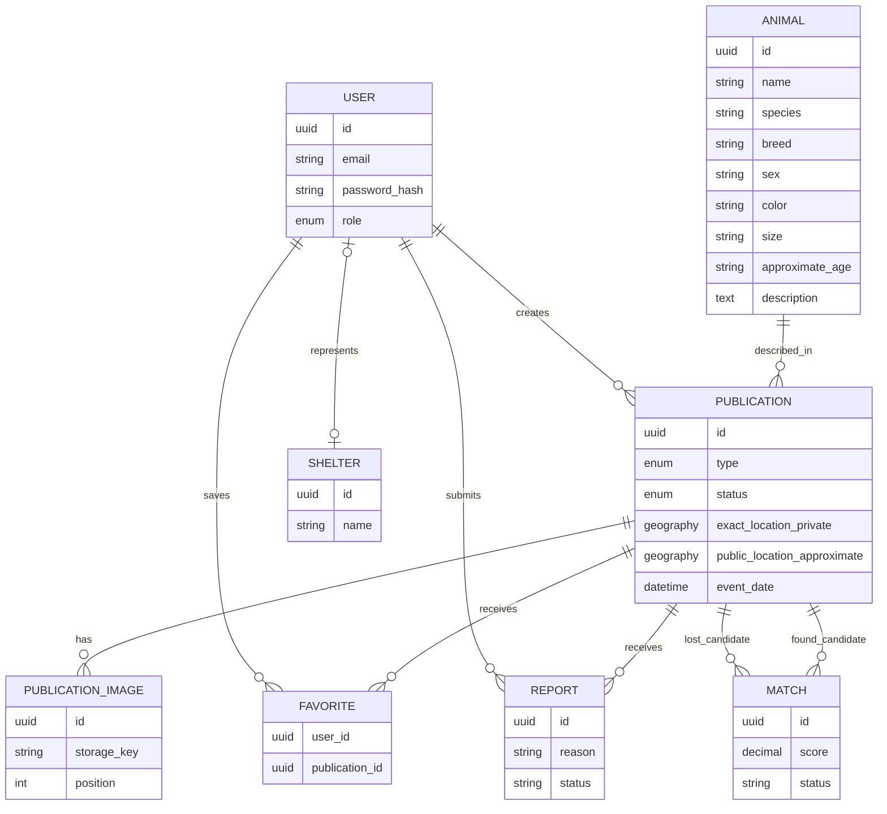

# Modelo de datos

## Estado

**Tooling implementado; modelo de negocio planificado.** Existe un pool central `pg`, cliente tipado Drizzle, configuración de Drizzle Kit y directorio versionado de migrations. No hay tablas ni migrations porque no se creará una entidad artificial. La conexión real no se ha verificado en este entorno.

## Decisión y conexión

- PostgreSQL es la fuente de verdad relacional.
- Drizzle ORM mantiene queries y schema explícitos, con Drizzle Kit para migrations.
- `pg` es el único driver: su `Pool` es adecuado para conexiones persistentes, tests de integración y hosting Node tradicional.
- `DATABASE_URL` es obligatoria, validada y consumida solo por configuración/cliente central.
- El pool limita conexiones, tiempo de espera de conexión y tiempo inactivo; se cierra en `SIGINT`/`SIGTERM`.

## Migrations

El schema estará en `apps/api/src/database/schema` y las migrations SQL versionadas en `apps/api/src/database/migrations`. Flujo futuro: editar schema, ejecutar `npm run db:generate`, revisar SQL y ejecutar `npm run db:migrate` solo contra el entorno confirmado. `db:studio` es una herramienta local y no se expondrá públicamente.

No se ha generado una migration vacía: Drizzle acepta un schema sin tablas y las entidades se incorporarán en el Milestone 3.

## Modelo conceptual inicial

El diagrama es conceptual: tipos, nulabilidad y relaciones podrán refinarse mediante migraciones y ADR.

## Entidades previstas

- `User`: identidad y rol futuro `USER`, `SHELTER` o `ADMIN`.
- `Animal`: descripción normalizada del animal; se decidirá si puede compartirse entre publicaciones.
- `Publication`: tipo `LOST`, `FOUND` o `ADOPTION`; estado `ACTIVE`, `RESOLVED`, `ADOPTED` o `ARCHIVED` con transiciones válidas.
- `PublicationImage`: referencias a objetos almacenados fuera de la BD y orden de presentación.
- `Favorite`: relación única usuario-publicación.
- `Report`: motivo, actor, estado y trazabilidad de moderación.
- `Shelter`: datos públicos/verificados de una protectora y su relación con usuarios.
- `Match`: candidatos `LOST ↔ FOUND`, puntuación, señales y decisión humana.

## Geolocalización y privacidad

La ubicación exacta interna y la pública aproximada serán atributos distintos. El acceso a la exacta será restringido y auditado. La aproximación debe evitar inversión mediante consultas repetidas; su precisión dependerá del riesgo y densidad. PostGIS permitirá índices espaciales y consultas por distancia cuando se implemente.

## Integridad y operación futuras

- Claves UUID y timestamps con zona horaria, sujetos a validación en el diseño físico.
- Constraints para enums, unicidad y relaciones; transacciones para cambios coordinados.
- Queries parametrizadas desde repositories.
- Migraciones versionadas, revisables y con estrategia de rollback/forward fix.
- Seeds solo con datos sintéticos; nunca datos personales de producción.
- Backups cifrados, restauraciones probadas y retención definida antes de producción.

## Índices

Cada índice futuro deberá responder a una query medida o a una constraint. Se priorizarán índices para claves foráneas, estados/filtros frecuentes y, posteriormente, GiST de PostGIS. Los índices vectoriales se decidirán únicamente con métricas del Milestone 14.

## pgvector

Se evaluará en el Milestone 14. Un embedding se asociaría a una versión de imagen/modelo y nunca sustituiría la decisión humana. Dimensiones, índice, proveedor, coste y borrado derivado deberán quedar documentados antes de crear el schema.
