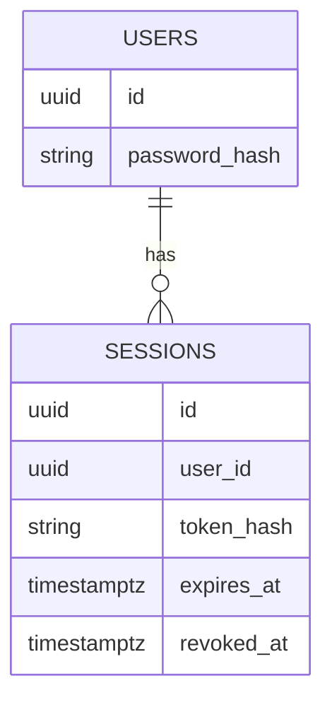
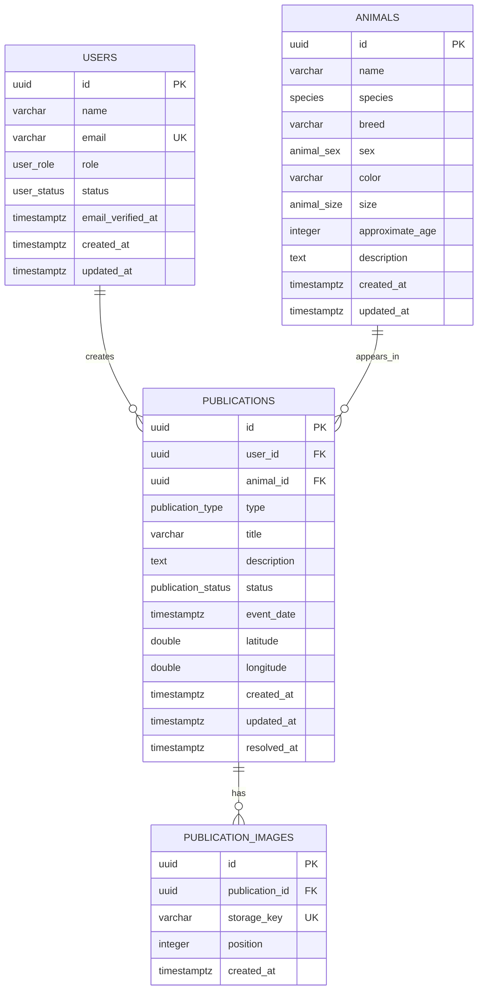

# Base de datos

## Operaciones funcionales de publicaciones

El modelo `User 1—N Publication N—1 Animal` se conserva. La migración aditiva del Milestone 7 almacena metadatos de las dos variantes de imagen y una outbox de borrado. El Bloque 3 implementa el repositorio transaccional y el upload HTTP sin alterar las migraciones aplicadas. Crear animal/publicación y editar ambos continúan siendo transacciones Drizzle.

`approximate_age` conserva la unidad definida en el modelo inicial: meses. La API limita el valor a 0–600 meses. `resolved_at` se establece para `RESOLVED`/`ADOPTED`; archivar lo mantiene null.

## Autenticación

`users.password_hash` es nullable durante la transición para conservar usuarios seed previos y cuentas de desarrollo existentes sin credenciales; todo registro público escribe un hash Argon2id. No bloquea el Milestone 4. Se revisará convertirlo a `NOT NULL` cuando todos los usuarios funcionales requieran autenticación. `sessions` contiene UUID, FK `user_id` con cascade, `token_hash` SHA-256 único, expiración, creación, último uso y revocación. El token opaco nunca se persiste.



La autenticación comprueba expiración en cada lectura; no depende de limpieza programada. `deleteExpired` prepara una tarea futura. `last_used_at` no se actualiza por request para evitar escrituras excesivas.

## Estado

El modelo inicial está implementado mediante PostgreSQL 17, Drizzle ORM y el driver único `pg`. Existe una migration versionada, seed idempotente y repositories base. La generación del SQL está verificada; la conexión/migration sobre una instancia real no pudo verificarse por falta de credenciales locales.

## Tablas implementadas



`favorites`, `reports`, `shelters` y `matches` son futuros. No existen en el schema actual.

## Decisiones de modelado

### UUID

Todas las claves primarias usan UUID v4 generado por PostgreSQL mediante `gen_random_uuid()`. PostgreSQL 17 lo incorpora sin activar una extensión adicional. El seed usa UUID fijos únicamente para ser idempotente.

### Usuarios y email

`name` y `email` son obligatorios. El repository elimina espacios exteriores y convierte el email a lowercase. La base refuerza lowercase mediante `CHECK` y unicidad mediante índice único. No se usa `citext`, evitando una extensión innecesaria.

`password_hash` existe y permanece nullable por la transición del schema y los usuarios seed/desarrollo anteriores sin credenciales. El registro funcional siempre guarda Argon2id. Convertirlo a `NOT NULL` es una tarea futura cuando todas las cuentas deban autenticarse. El seed no contiene passwords ni un administrador operativo.

### Enums

Se usan enums PostgreSQL porque los conjuntos actuales son pequeños y forman invariantes estructurales:

- roles: `USER`, `SHELTER`, `ADMIN`;
- usuario: `ACTIVE`, `BLOCKED`;
- especie: `DOG`, `CAT`, `OTHER`;
- sexo: `MALE`, `FEMALE`, `UNKNOWN`;
- tamaño: `SMALL`, `MEDIUM`, `LARGE`, `UNKNOWN`;
- publicación: `LOST`, `FOUND`, `ADOPTION`;
- estado: `ACTIVE`, `RESOLVED`, `ADOPTED`, `ARCHIVED`.

Añadir valores requiere migration, lo que hace la evolución explícita.

### Animales y publicaciones

El nombre del animal es nullable porque un animal encontrado puede ser desconocido. Especie es obligatoria; raza, color, edad aproximada y descripción pueden faltar. `approximate_age` se expresa provisionalmente en meses y no puede ser negativa.

Un animal puede aparecer en varias publicaciones a lo largo del tiempo. `event_date` representa el suceso relevante y no se confunde con `created_at`.

### Ubicación

`latitude` y `longitude` son columnas legacy temporales. El backfill aplicado trasladó su información al modelo exacto/público y limpió las filas migradas; ningún SELECT, DTO, filtro, distancia, orden o mapa público las usa. Se conservan por ahora para compatibilidad estructural y podrán eliminarse mediante una migración futura cuando todos los entornos hayan confirmado backfill y no se necesite rollback compatible.

`0003_unique_omega_flight.sql` añade `exact_location geography(Point,4326)`, `public_location geography(Point,4326)`, `public_location_radius_meters` y `location_privacy_version`. LOST conserva exacta y radio público de 1.000 m; FOUND, exacta y 1.500 m; ADOPTION mantiene exacta `NULL` y una zona de 5.000 m. Un GiST sobre `public_location` soporta `ST_DWithin` en metros. La migración está aplicada y validada en PostgreSQL 17/PostGIS 3.6.2 local y test.

El Bloque 3 usa ese GiST mediante `ST_DWithin` y calcula `ST_Distance` en metros. Filtro y distancia públicos referencian exclusivamente `public_location`; `exact_location` no aparece en el SELECT público. Los mismos predicados se reutilizan para filas y count, combinados con tipo, especie, estado, ownership y archivado.

Las columnas legacy se convierten mediante un backfill explícito e idempotente: LOST/FOUND trasladan el punto a exacta y generan una zona aleatoria; ADOPTION usa el legacy solo como referencia y deja exacta `NULL`; filas sin coordenadas permanecen vacías. Tras escribir el modelo completo se limpian `latitude`/`longitude`. Su eliminación física queda para otra migración. Nunca se copia la exacta directamente como pública.

### Imágenes

PostgreSQL solo almacena metadatos y keys neutrales, nunca binarios, originales ni URLs de proveedor. `storage_key` identifica `display.webp` y `thumbnail_storage_key` su thumbnail. Ambas son únicas. MIME normalizado es `image/webp`; dimensiones, bytes y SHA-256 se almacenan separadamente por variante para integridad y ETag independientes.

Las columnas añadidas son nullable para aceptar filas legacy sin metadatos. Los `CHECK` exigen que cada grupo esté completamente vacío o completamente informado, dimensiones positivas dentro de 2048/640 px, bytes positivos y checksum hexadecimal de 64 caracteres. Las nuevas escrituras deberán completar ambas variantes. `position >= 0`, `(publication_id, position)` es única y `position = 0` es la principal. El máximo de seis imágenes se impondrá en aplicación y transacción.

`storage_deletion_jobs` es exclusivamente una outbox pequeña para borrar objetos: key, intentos, próximo intento, último error sanitizado, creación y finalización. No tiene FK porque debe sobrevivir al metadato eliminado. Un índice por finalización/próximo intento soporta el consumo de pendientes. Delete elimina metadata, compacta posiciones y crea jobs para display/thumbnail dentro de una única transacción; el servicio intenta procesarlos tras commit y deja los fallidos pendientes. No existe cron ni framework genérico de workers.

### Métodos de contacto por publicación

`0004_ancient_blue_blade.sql` crea el enum `publication_contact_method` (`WHATSAPP`, `PHONE`, `EMAIL`) y la tabla subordinada `publication_contact_methods`. Cada fila contiene UUID, `publication_id`, método, valor y timestamps UTC. La FK usa `ON DELETE CASCADE`; `(publication_id, method)` es único y cubre las lecturas por publicación. No existen `user_id`, `enabled` ni índice sobre `value`.

Ausencia de fila significa método deshabilitado y `replaceAll([])` elimina físicamente la configuración. El repository reemplaza todas las filas en una transacción y devuelve el orden determinista `WHATSAPP`, `PHONE`, `EMAIL`.

La base exige valor trimmed/no vacío, email de hasta 254 caracteres y teléfono/WhatsApp en E.164 `^[+][1-9][0-9]{7,14}$`. La validación sintáctica completa de email permanece en aplicación. Los valores son snapshots: no existe vínculo ni copia automática desde `users.email`.

Los datos se almacenan inicialmente en texto normal para poder revelarlos en el futuro flujo autorizado. No se hashean porque deben ser recuperables. Cifrado de campo/envelope encryption y gestión externa de claves quedan como revisión obligatoria antes de producción real.

## Timestamps

Todos los timestamps usan `timestamptz` y se interpretan en UTC. La futura UI convertirá a zona local. `updated_at` se actualizará explícitamente en repositories/casos de uso; no se oculta en triggers en esta fase.

## Foreign keys y borrado

- `publications.user_id → users.id`: `RESTRICT`; una eliminación de cuenta no destruye silenciosamente historial y debe pasar por una política de privacidad/moderación.
- `publications.animal_id → animals.id`: `RESTRICT`; evita eliminar un animal referenciado.
- `publication_images.publication_id → publications.id`: `CASCADE`; una imagen es un registro subordinado sin significado independiente.

No se aplica soft delete genérico. Usuarios y publicaciones ya tienen estados para bloqueo/archivo; el borrado y anonimización se diseñarán por requisito, no mediante una columna universal.

## Índices

- único `users.email`;
- `publications.user_id` y `publications.animal_id` para joins/FK;
- `publications.type`, `status`, `event_date` y `created_at` para filtros/orden previstos;
- único `(publication_images.publication_id, position)`, que también cubre búsquedas por publicación;
- único `publication_images.storage_key`.

No se añaden índices combinados sin queries y mediciones reales.

## Migrations

Las migrations aplicadas no se modifican. `0002_abandoned_raider.sql` añade los metadatos de imagen y `storage_deletion_jobs`. `0004_ancient_blue_blade.sql` añade exclusivamente el enum y tabla de contacto. Flujo:

```bash
npm run db:generate
npm run db:migrate
```

Se revisa el SQL generado y no se usa `db push` como flujo principal.

Milestone 8 crea `0003_unique_omega_flight.sql`. Incluye la extensión PostGIS, cuatro columnas nullable, completitud conjunta de metadata pública, radio `1..10000`, versión positiva y GiST público. Antes de aplicarlo se verifica PostgreSQL 17/puerto 5433/base prevista y se usa una identidad autorizada para crear la extensión.

Tras aplicar la migración, el backfill se inspecciona y ejecuta separadamente:

```bash
npm run db:location:backfill -- --dry-run
npm run db:location:backfill -- --apply
```

## Seed

`npm run db:seed` inserta mediante `ON CONFLICT DO NOTHING` dos usuarios `USER` sin contraseña, tres animales y tres publicaciones. No crea imágenes ficticias ni incluye binarios demo. Es explícito, repetible y está bloqueado si `NODE_ENV=production`.

## Desarrollo y tests

La aplicación consume exclusivamente `DATABASE_URL`, ya apunte a Windows, Docker o cloud. Compose ofrece PostgreSQL 17 como entorno local reproducible opcional en `localhost:5434` (`5432` interno); sus credenciales son development-only. `DATABASE_TEST_URL` debe ser distinta, terminar en `_test` y ejecutarse con `NODE_ENV=test`; los tests eliminan filas en orden de dependencias, pero nunca ejecutan `DROP` o `TRUNCATE`.

## Evolución futura

- Retirada de `latitude`/`longitude` legacy mediante una migración posterior y revisada, nunca modificando `0003`.
- `favorites`, `reports`, `shelters` y `matches`: milestones posteriores.
- pgvector y embeddings: Milestone 14, condicionado a evaluación técnica y de privacidad.
