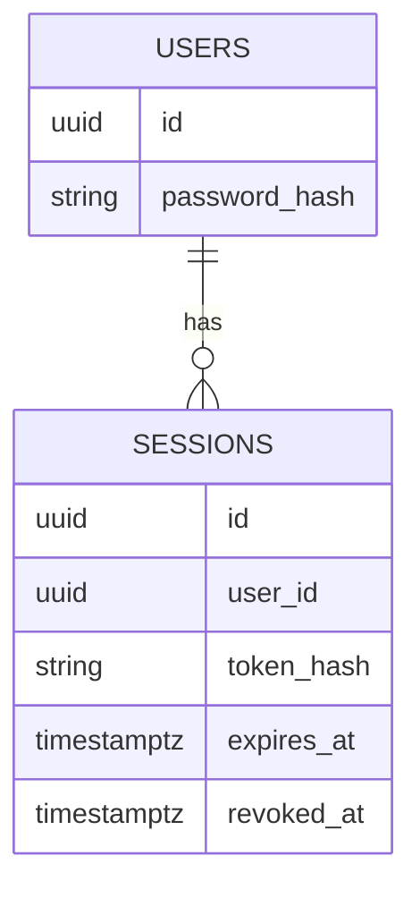
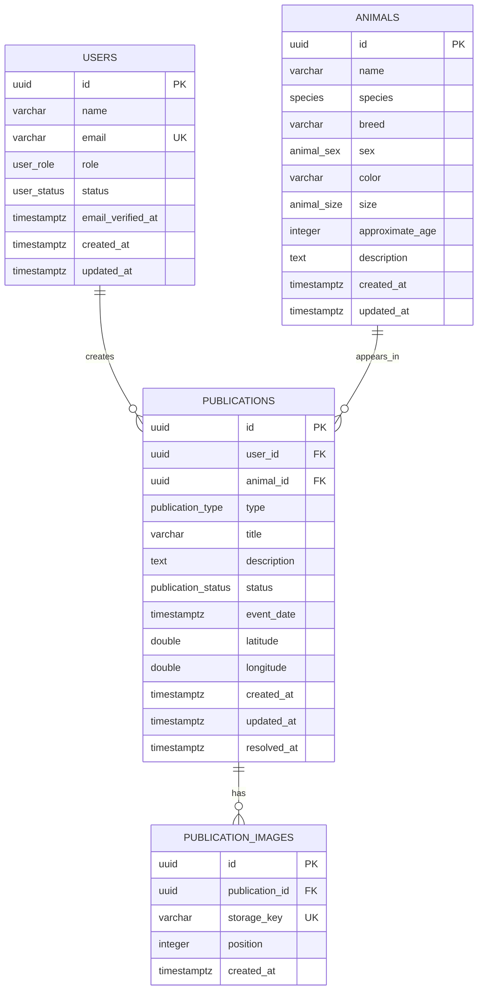

# Base de datos

## Operaciones funcionales de publicaciones

El modelo existente `User 1—N Publication N—1 Animal` no cambia y este milestone no requiere migration. Crear animal/publicación y editar ambos son transacciones Drizzle: un fallo revierte todo y evita animales o cambios parciales. `updated_at` se asigna explícitamente al editar publicación/animal. Las imágenes existentes se leen por posición, pero no existe upload.

`approximate_age` conserva la unidad definida en el modelo inicial: meses. La API limita el valor a 0–600 meses. `resolved_at` se establece para `RESOLVED`/`ADOPTED`; archivar lo mantiene null.

## Autenticación

`users.password_hash` es nullable durante la transición para conservar usuarios seed previos y cuentas de desarrollo existentes sin credenciales; todo registro público escribe un hash Argon2id. No bloquea el Milestone 4. Se revisará convertirlo a `NOT NULL` cuando todos los usuarios funcionales requieran autenticación. `sessions` contiene UUID, FK `user_id` con cascade, `token_hash` SHA-256 único, expiración, creación, último uso y revocación. El token opaco nunca se persiste.



La autenticación comprueba expiración en cada lectura; no depende de limpieza programada. `deleteExpired` prepara una tarea futura. `last_used_at` no se actualiza por request para evitar escrituras excesivas.

## Estado

El modelo inicial está implementado mediante PostgreSQL 17, Drizzle ORM y el driver único `pg`. Existe una migration versionada, seed idempotente y repositories base. La generación del SQL está verificada; la conexión/migration sobre una instancia real no pudo verificarse por falta de credenciales locales.

## Tablas implementadas



`favorites`, `reports`, `shelters` y `matches` son futuros. No existen en el schema actual.

## Decisiones de modelado

### UUID

Todas las claves primarias usan UUID v4 generado por PostgreSQL mediante `gen_random_uuid()`. PostgreSQL 17 lo incorpora sin activar una extensión adicional. El seed usa UUID fijos únicamente para ser idempotente.

### Usuarios y email

`name` y `email` son obligatorios. El repository elimina espacios exteriores y convierte el email a lowercase. La base refuerza lowercase mediante `CHECK` y unicidad mediante índice único. No se usa `citext`, evitando una extensión innecesaria.

`password_hash` existe y permanece nullable por la transición del schema y los usuarios seed/desarrollo anteriores sin credenciales. El registro funcional siempre guarda Argon2id. Convertirlo a `NOT NULL` es una tarea futura cuando todas las cuentas deban autenticarse. El seed no contiene passwords ni un administrador operativo.

### Enums

Se usan enums PostgreSQL porque los conjuntos actuales son pequeños y forman invariantes estructurales:

- roles: `USER`, `SHELTER`, `ADMIN`;
- usuario: `ACTIVE`, `BLOCKED`;
- especie: `DOG`, `CAT`, `OTHER`;
- sexo: `MALE`, `FEMALE`, `UNKNOWN`;
- tamaño: `SMALL`, `MEDIUM`, `LARGE`, `UNKNOWN`;
- publicación: `LOST`, `FOUND`, `ADOPTION`;
- estado: `ACTIVE`, `RESOLVED`, `ADOPTED`, `ARCHIVED`.

Añadir valores requiere migration, lo que hace la evolución explícita.

### Animales y publicaciones

El nombre del animal es nullable porque un animal encontrado puede ser desconocido. Especie es obligatoria; raza, color, edad aproximada y descripción pueden faltar. `approximate_age` se expresa provisionalmente en meses y no puede ser negativa.

Un animal puede aparecer en varias publicaciones a lo largo del tiempo. `event_date` representa el suceso relevante y no se confunde con `created_at`.

### Ubicación

`latitude` y `longitude` son coordenadas exactas internas temporales, nunca una respuesta pública automática. Deben existir juntas y respetar `[-90, 90]` y `[-180, 180]`. En el milestone geoespacial se incorporará PostGIS y una representación pública aproximada separada; la migración deberá conservar la distinción y minimizar precisión almacenada.

### Imágenes

PostgreSQL solo almacena un `storage_key` neutral, nunca binarios ni URLs de proveedor. `position >= 0`, la pareja `(publication_id, position)` es única y `storage_key` no se repite. El límite máximo de imágenes será una regla de aplicación porque depende del producto.

## Timestamps

Todos los timestamps usan `timestamptz` y se interpretan en UTC. La futura UI convertirá a zona local. `updated_at` se actualizará explícitamente en repositories/casos de uso; no se oculta en triggers en esta fase.

## Foreign keys y borrado

- `publications.user_id → users.id`: `RESTRICT`; una eliminación de cuenta no destruye silenciosamente historial y debe pasar por una política de privacidad/moderación.
- `publications.animal_id → animals.id`: `RESTRICT`; evita eliminar un animal referenciado.
- `publication_images.publication_id → publications.id`: `CASCADE`; una imagen es un registro subordinado sin significado independiente.

No se aplica soft delete genérico. Usuarios y publicaciones ya tienen estados para bloqueo/archivo; el borrado y anonimización se diseñarán por requisito, no mediante una columna universal.

## Índices

- único `users.email`;
- `publications.user_id` y `publications.animal_id` para joins/FK;
- `publications.type`, `status`, `event_date` y `created_at` para filtros/orden previstos;
- único `(publication_images.publication_id, position)`, que también cubre búsquedas por publicación;
- único `publication_images.storage_key`.

No se añaden índices combinados sin queries y mediciones reales.

## Migrations

La migration inicial es `apps/api/src/database/migrations/0000_blue_wolfsbane.sql`. Flujo:

```bash
npm run db:generate
npm run db:migrate
```

Se revisa el SQL generado y no se usa `db push` como flujo principal.

## Seed

`npm run db:seed` inserta mediante `ON CONFLICT DO NOTHING` dos usuarios `USER` sin contraseña, tres animales, tres publicaciones y dos claves de imagen sintéticas. Es explícito, repetible y está bloqueado si `NODE_ENV=production`.

## Desarrollo y tests

La aplicación consume exclusivamente `DATABASE_URL`, ya apunte a Windows, Docker o cloud. Compose ofrece PostgreSQL 17 como entorno local reproducible opcional en `localhost:5434` (`5432` interno); sus credenciales son development-only. `DATABASE_TEST_URL` debe ser distinta, terminar en `_test` y ejecutarse con `NODE_ENV=test`; los tests eliminan filas en orden de dependencias, pero nunca ejecutan `DROP` o `TRUNCATE`.

## Evolución futura

- PostGIS y ubicación pública aproximada: Milestone 7.
- `favorites`, `reports`, `shelters` y `matches`: milestones posteriores.
- pgvector y embeddings: Milestone 14, condicionado a evaluación técnica y de privacidad.
