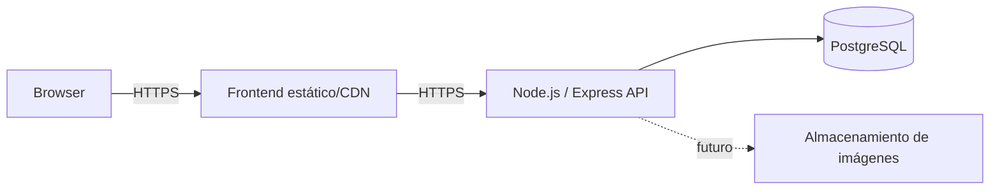

# Estrategia de deployment

**Estado: Pendiente.** No hay infraestructura ni entorno desplegado. Existe CI y un Compose opcional exclusivamente para un PostgreSQL 17 local reproducible; no es una arquitectura de producción. Las plataformas se elegirán cuando existan requisitos operativos medibles.

La aplicación depende únicamente de `DATABASE_URL`: PostgreSQL puede proceder de una instalación Windows local, Docker o un servicio cloud sin cambios en el código. Compose publica `5434:5432` para no colisionar con las instalaciones locales en 5432 y 5433. Sus credenciales `red_huella_app`/`red_huella_dev_only` son development-only y nunca deben reutilizarse en producción.

## Topología futura

## Requisitos previstos

- Frontend compilado como assets versionados y servido por HTTPS.
- API Node ejecutada como proceso no privilegiado, con health checks, límites y cierre ordenado.
- PostgreSQL gestionado o administrado con backups, cifrado, red restringida y restauración probada.
- Variables de entorno validadas al arrancar; secretos proporcionados por el entorno, nunca por Git.
- CORS con allowlist de los orígenes reales.
- Migraciones versionadas antes o durante releases mediante un proceso controlado, no automáticamente desde cada réplica.
- Logs y métricas sin datos sensibles; alertas proporcionadas al riesgo.

## Entornos futuros

Se prevén al menos local, CI/test y producción. Un staging solo se añadirá si aporta valor al flujo. Cada entorno tendrá recursos, credenciales y datos separados; producción no se usará para pruebas.

## Flujo de release previsto

1. CI ejecuta lint, typecheck, tests y build.
2. Se construye un artefacto reproducible e identificable por commit.
3. Se aplican migraciones compatibles mediante tarea controlada.
4. Se despliega y verifican health checks/smoke tests.
5. Se observa la release y se ejecuta rollback o forward fix si falla.

## Decisiones pendientes

Hosting, región, dominio, proveedor de object storage, estrategia de backups, observabilidad, presupuesto y objetivos de disponibilidad. El Compose local no determina el empaquetado ni el despliegue futuro de la aplicación.

## Almacenamiento de imágenes

Desarrollo configura `IMAGE_STORAGE_DRIVER=local` y `IMAGE_STORAGE_LOCAL_ROOT=.data/uploads`; `.data/tmp` queda reservado para temporales de procesamiento. Ambos directorios están fuera de Git y de `apps/web/public`. El proceso debe ser su único escritor, ejecutarse con permisos mínimos y disponer de espacio limitado.

El backend crea ambos directorios cuando son necesarios y limpia temporales al terminar, cerrar o fallar una petición. Producción debe montar storage persistente privado, limitar espacio/inodos y monitorizar tanto `.data/tmp` como jobs pendientes. `ProcessStorageDeletionJobsService` puede invocarse manualmente; este bloque no instala scheduler. El rate limiter de upload es in-memory y requiere un backend compartido o control equivalente antes de escalar horizontalmente.

El filesystem local solo es válido para desarrollo o un despliegue de una réplica con volumen persistente. Producción multi-réplica deberá implementar el mismo contrato sobre S3/R2 compatible, bucket privado y credenciales de mínimo privilegio. Backups/restauración deberán coordinar PostgreSQL y objetos. No se ha implementado aún ese adaptador ni deben declararse sus secretos. La entrega futura no usará caché pública immutable larga y debe respetar el archivado de publicaciones.
