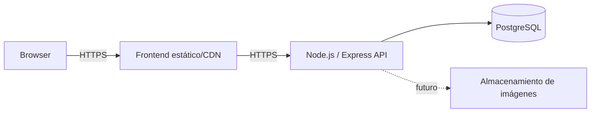

# Estrategia de deployment

**Estado: Pendiente.** No hay infraestructura, Docker, pipeline ni entorno desplegado. Las plataformas se elegirán cuando existan requisitos operativos medibles.

## Topología futura

## Requisitos previstos

- Frontend compilado como assets versionados y servido por HTTPS.
- API Node ejecutada como proceso no privilegiado, con health checks, límites y cierre ordenado.
- PostgreSQL gestionado o administrado con backups, cifrado, red restringida y restauración probada.
- Variables de entorno validadas al arrancar; secretos proporcionados por el entorno, nunca por Git.
- CORS con allowlist de los orígenes reales.
- Migraciones versionadas antes o durante releases mediante un proceso controlado, no automáticamente desde cada réplica.
- Logs y métricas sin datos sensibles; alertas proporcionadas al riesgo.

## Entornos futuros

Se prevén al menos local, CI/test y producción. Un staging solo se añadirá si aporta valor al flujo. Cada entorno tendrá recursos, credenciales y datos separados; producción no se usará para pruebas.

## Flujo de release previsto

1. CI ejecuta lint, typecheck, tests y build.
2. Se construye un artefacto reproducible e identificable por commit.
3. Se aplican migraciones compatibles mediante tarea controlada.
4. Se despliega y verifican health checks/smoke tests.
5. Se observa la release y se ejecuta rollback o forward fix si falla.

## Decisiones pendientes

Hosting, región, dominio, almacenamiento de imágenes, estrategia de backups, observabilidad, presupuesto y objetivos de disponibilidad. Docker no se introducirá hasta que facilite un entorno o despliegue definido.
