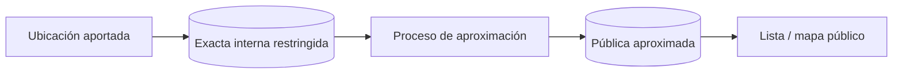

# Privacidad

## Datos de autenticación

Se minimizan a nombre, email normalizado, hash de contraseña y metadatos de sesión. El cliente solo recibe un token opaco en cookie HttpOnly; la base conserva su hash. No se registran credenciales ni cookies. La política operativa de retención/borrado de sesiones expiradas queda pendiente antes de producción.

## Estado y principios

**Estrategia planificada; no hay tratamiento de datos de usuarios en la aplicación actual.** Red Huella aplicará minimización, limitación de finalidad, privacidad por defecto, transparencia y retención limitada. Antes de producción se concretarán base jurídica, responsables, derechos y textos aplicables con asesoramiento adecuado.

## Ubicación exacta y ubicación pública

- La coordenada exacta interna solo se conservará si es necesaria para búsqueda o contacto y tendrá acceso restringido.
- La representación pública aproximada será un dato separado, con precisión reducida según riesgo y densidad.
- La aproximación debe ser estable para evitar reconstrucción del punto mediante múltiples respuestas aleatorias.
- El mapa y la API pública nunca recibirán el campo exacto por defecto.
- Se explicará al usuario qué ubicación se conserva y cuál se mostrará antes de publicar.
- Direcciones de domicilios, refugios temporales y lugares sensibles exigirán especial cautela.
- Compartir el punto exacto entre partes, si se implementa, requerirá un flujo explícito, autenticado, limitado y auditable.

### Estado del modelo actual

`publications.latitude` y `longitude` almacenan provisionalmente la pareja exacta interna y aplican rangos válidos. No existe endpoint que las exponga. No se ha implementado todavía ubicación pública ni algoritmo de aproximación. En el Milestone 7 se migrará a PostGIS y se añadirá una representación pública separada, evitando derivar o publicar automáticamente un domicilio. Hasta entonces deben usarse solo datos sintéticos y conservar la mínima precisión necesaria.

## Imágenes y EXIF

Las imágenes pueden revelar personas, matrículas, viviendas y GPS. El sistema futuro limitará contenido y finalidad, eliminará EXIF antes de exponer archivos, generará derivados seguros y permitirá retirar imágenes. Se advertirá que solo deben subirse imágenes con derecho a hacerlo. Los originales, si fueran necesarios, tendrán acceso y retención distintos.

## Datos personales e información pública

Se distinguirán claramente perfil privado, datos de contacto autorizados y contenido público. Email, identificadores técnicos, coordenadas exactas y datos de moderación no serán públicos por defecto. Se evitarán campos libres innecesarios y se advertirá frente a publicar teléfonos, direcciones u otros datos sensibles en descripciones.

## Minimización y finalidad

Cada campo deberá justificar su necesidad. Matching y analítica reutilizarán datos solo de acuerdo con una finalidad informada. Los embeddings futuros son datos derivados vinculables a una imagen y heredarán sus reglas de acceso y eliminación.

## Eliminación, retención y copias

- Se implementarán flujos futuros para eliminar cuenta, publicación e imágenes, con confirmación y protección frente a abuso.
- Antes de producción se definirá una matriz de retención para cuentas, publicaciones, logs, reportes, backups, ubicaciones, imágenes y embeddings.
- Los datos derivados se eliminarán o desvincularán cuando se elimine su fuente, salvo obligación justificada.
- Las copias de seguridad tendrán expiración y el borrado se propagará según una política transparente.
- Algunos registros de seguridad o moderación podrían conservarse de forma limitada si existe una necesidad y base válida.

## Derechos y transparencia

La aplicación futura facilitará acceso, rectificación, eliminación y, cuando corresponda, exportación u oposición. La política pública indicará responsable, contacto, finalidades, destinatarios, retención y mecanismos de reclamación antes de aceptar usuarios reales.
