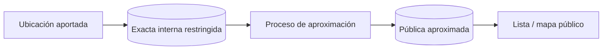

# Privacidad

## Ubicación en publicaciones

La API pública devuelve exclusivamente una ubicación aproximada persistida. El punto exacto de LOST/FOUND queda restringido al propietario autenticado y ADOPTION no almacena domicilio exacto. Las coordenadas no se escriben en logs.

## Datos de autenticación

Se minimizan a nombre, email normalizado, hash de contraseña y metadatos de sesión. El cliente solo recibe un token opaco en cookie HttpOnly; la base conserva su hash. No se registran credenciales ni cookies. La política operativa de retención/borrado de sesiones expiradas queda pendiente antes de producción.

## Estado y principios

**Estrategia planificada; no hay tratamiento de datos de usuarios en la aplicación actual.** Red Huella aplicará minimización, limitación de finalidad, privacidad por defecto, transparencia y retención limitada. Antes de producción se concretarán base jurídica, responsables, derechos y textos aplicables con asesoramiento adecuado.

## Ubicación exacta y ubicación pública

- La coordenada exacta interna solo se conservará si es necesaria para búsqueda o contacto y tendrá acceso restringido.
- La representación pública aproximada será un dato separado, con precisión reducida según riesgo y densidad.
- La aproximación debe ser estable para evitar reconstrucción del punto mediante múltiples respuestas aleatorias.
- El mapa y la API pública nunca recibirán el campo exacto por defecto.
- Se explicará al usuario qué ubicación se conserva y cuál se mostrará antes de publicar.
- Direcciones de domicilios, refugios temporales y lugares sensibles exigirán especial cautela.
- Compartir el punto exacto entre partes, si se implementa, requerirá un flujo explícito, autenticado, limitado y auditable.

### Estado del modelo actual

`publications.exact_location` y `public_location` son columnas `geography(Point,4326)` separadas; la pareja legacy ya no participa en respuestas ni consultas públicas.

ADR-022 implementa una ubicación pública aleatoria, persistida y versionada, generada exclusivamente por servidor. LOST conserva exacta y publica una zona de 1.000 m; FOUND conserva exacta y publica 1.500 m. En ambos casos el centro público se desplaza como máximo el radio declarado mediante cálculo esférico, por lo que la zona contiene el punto exacto. ADOPTION interpreta la entrada como zona, mantiene `exact_location` en `NULL` y publica un radio de 5.000 m. No se recalcula la aproximación en cada GET.

El DTO público elimina la pareja legacy y nunca hace fallback: sin `public_location` devuelve `publicLocation: null`. Toda operación espacial pública usa solo `public_location`. La lectura exacta de LOST/FOUND exige sesión y ownership mediante `/api/v1/publications/:id/manage`. Las coordenadas no se incluyen en logs.

El selector frontend no solicita geolocalización al cargar ni persiste coordenadas en `localStorage`/`sessionStorage`: solo mantiene el valor durante el formulario y lo envía al guardar. En edición, el centro `publicLocation` de ADOPTION es referencia visual y nunca se copia a `exactLocation`. Los modos del componente separan de forma explícita el uso exacto owner del uso como zona.

La exploración cercana también solicita permiso solo tras una acción explícita. El centro del visitante vive en memoria, no se incorpora a la URL visible ni a Web Storage y se descarta, junto con su caché geográfica, al quitar la búsqueda. Se transmite a la API únicamente para ejecutar la consulta solicitada. Cards y mapas públicos reciben solo `publicLocation`; las distancias se describen como aproximadas respecto del centro público y nunca como distancia al animal o al punto exacto.

El endpoint backend del mapa global filtra y devuelve exclusivamente `public_location`. Su DTO mínimo no incluye exacta, legacy, autor, contacto ni descripción. Una prueba de regresión mantiene separados ambos puntos: exacta dentro/pública fuera queda excluida y pública dentro/exacta fuera queda incluida. Los bounds viajan en query por necesidad funcional, pero el logger solo registra el path y los errores no los reproducen.

La interfaz global consume únicamente ese DTO. Markers, popup y mini lista no representan coordenadas ni radio como texto, y no reciben autor, contacto, descripción o exacta. La forma redondeada con halo y letra por tipo evita sugerir precisión y no depende solo del color; una leyenda explica que son zonas aproximadas. No solicita geolocalización ni persiste applied/pending bounds o selección en Web Storage. Pan y zoom solo modifican estado efímero; los bounds aparecen en la URL de API exclusivamente tras la acción explícita **Buscar en esta zona**. No se escriben en logs frontend.

El Bloque 3 implementa esa separación completa: búsqueda, distancia y orden públicos usan solo el punto aproximado. `/manage` es la única respuesta de publicación que puede contener `exactLocation`, requiere owner y no permite caché compartida; ADOPTION devuelve exacta `null`. La distancia expuesta se redondea y describe distancia al centro público, no al lugar exacto.

## Imágenes y EXIF

Las imágenes pueden revelar personas, matrículas, viviendas y GPS. La implementación elimina EXIF/GPS y demás metadatos, re-encodea display y thumbnail y no conserva originales. Las keys internas no se exponen y el owner puede retirar imágenes incluso con la publicación archivada. Al archivar, el contenido deja de ser público y solo el owner autenticado puede recuperarlo; no se configura caché pública inmutable. La outbox conserva solo la key y datos operativos mínimos hasta completar el borrado físico. La eliminación técnica de metadata no elimina información visible dentro de los píxeles, por lo que la futura UI debe advertir sobre derechos y contenido sensible.

## Datos personales e información pública

Se distinguirán claramente perfil privado, datos de contacto autorizados y contenido público. Email, identificadores técnicos, coordenadas exactas y datos de moderación no serán públicos por defecto. Se evitarán campos libres innecesarios y se advertirá frente a publicar teléfonos, direcciones u otros datos sensibles en descripciones.

### Contacto por publicación

ADR-023 separa WhatsApp, teléfono y email en `publication_contact_methods`. Son snapshots voluntarios por publicación y nunca se copian automáticamente desde el email de login ni entre métodos. Ausencia de fila significa que el método no está habilitado; retirarlo provoca borrado físico de la fila.

Los endpoints owner `GET/PUT /publications/:id/contact-settings` están implementados con sesión, ownership y respuestas `private, no-store` sin ETag. Permiten leer en cualquier estado y retirar PII siempre; solo `ACTIVE` permite añadir o modificar.

La revelación mediante `GET /publications/:id/contact` exige usuario autenticado activo, publicación `ACTIVE`, autor activo y al menos un método. Usa rate limiting por usuario/IP y un 404 común para no distinguir causas. No forma parte de cards o listados: el frontend lo consulta únicamente tras pulsar «Ver opciones de contacto». `PublicPublicationDto`, `/manage`, listados y búsqueda geográfica permanecen sin contacto; `RESOLVED`, `ADOPTED` y `ARCHIVED` no lo exponen ni al owner mediante esta ruta.

La configuración owner es voluntaria, específica de cada publicación y comienza vacía. La interfaz no copia el email de acceso ni infiere países o prefijos telefónicos. Advierte que los valores solo se revelarán a usuarios autenticados y que desactivar un método lo elimina. Su query de edición no se persiste, usa frescura inmediata y se retira de memoria al salir de la edición o cerrar sesión. Contacto no aparece en cards o listados y el detalle solo consume la ruta de revelación tras click explícito.

El Bloque 5 mantiene la PII ausente del HTML y de la red hasta la acción explícita. La query de revelación no se persiste, no incluye valores en su key y se elimina al ocultar, desmontar, cambiar de publicación o cerrar sesión. No se escribe contacto en `localStorage` ni `sessionStorage`. Volver desde login no dispara la revelación automáticamente: hay que pulsar de nuevo el botón.

Los valores se guardan temporalmente en texto normal porque deben ser recuperables y el proyecto no dispone de gestión externa de claves. Una filtración de base o backup podría exponerlos. Antes de producción se revisarán cifrado de backups, permisos, retención y envelope encryption de aplicación. Los valores no se indexan ni deben aparecer en logs, métricas, errores o caches persistentes del navegador.

## Minimización y finalidad

Cada campo deberá justificar su necesidad. Matching y analítica reutilizarán datos solo de acuerdo con una finalidad informada. Los embeddings futuros son datos derivados vinculables a una imagen y heredarán sus reglas de acceso y eliminación.

## Eliminación, retención y copias

- Se implementarán flujos futuros para eliminar cuenta, publicación e imágenes, con confirmación y protección frente a abuso.
- Antes de producción se definirá una matriz de retención para cuentas, publicaciones, logs, reportes, backups, ubicaciones, imágenes y embeddings.
- Los datos derivados se eliminarán o desvincularán cuando se elimine su fuente, salvo obligación justificada.
- Las copias de seguridad tendrán expiración y el borrado se propagará según una política transparente.
- Algunos registros de seguridad o moderación podrían conservarse de forma limitada si existe una necesidad y base válida.

## Derechos y transparencia

La aplicación futura facilitará acceso, rectificación, eliminación y, cuando corresponda, exportación u oposición. La política pública indicará responsable, contacto, finalidades, destinatarios, retención y mecanismos de reclamación antes de aceptar usuarios reales.
